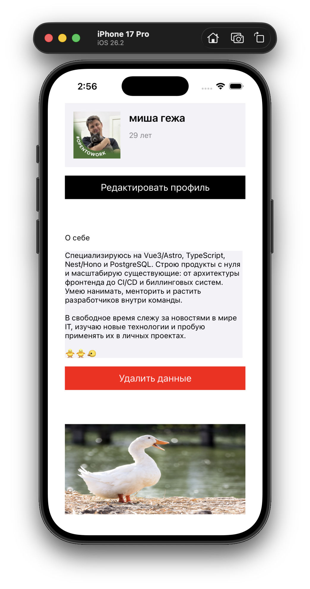

# f12m2l1

## output

| idle                                                   | after `handleEdit`                                           | after `handleRemove`                                           |
| ------------------------------------------------------ | ------------------------------------------------------------ | -------------------------------------------------------------- |
|  |  |  |
